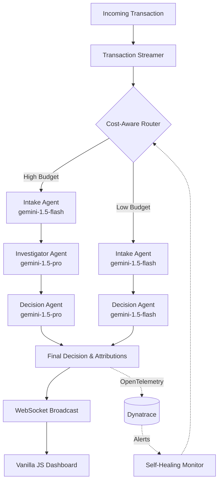

# FinSentinel — Agentic Fraud Operations Platform

<div align="center">
  
</div>

FinSentinel is an advanced, multi-agent AI fraud detection and operations platform. Built for the Google Cloud Rapid Cloud Agent Hackathon, it demonstrates how **Agentic AI** can be used to autonomously investigate, score, and remediate financial transactions in real-time, while being strictly governed by **cost-aware adaptive routing** and **Dynatrace observability**.

---

## 🌟 Key Features

1. **Multi-Agent Gemini Architecture**
   - **Intake Agent:** Performs first-pass triage using `gemini-1.5-flash` to rapidly discard obvious false positives.
   - **Investigator Agent:** Uses `gemini-1.5-pro` to conduct deep-dive forensic analysis, querying external databases and assessing spatial/temporal anomalies.
   - **Decision Agent:** Synthesizes the investigation to make a final APPROVE / FLAG / BLOCK ruling, outputting **LLM Feature Attributions** to explain the exact vectors that led to the decision.

2. **Cost-Aware Adaptive Routing (FinOps)**
   - The platform tracks **real token consumption** via the Vertex AI usage metadata.
   - A `BudgetController` tracks the session spend against a hard cap (e.g., $5.00/hour).
   - As the budget reaches exhaustion limits (e.g., >80% utilization), the `Router` automatically degrades the pipeline, forcing all requests to the cheaper `gemini-1.5-flash` model to ensure operational continuity without exceeding financial limits.

3. **Dynatrace MCP & Observability**
   - Full OpenTelemetry integration streams agent decisions, risk scores, and token costs directly to Dynatrace.
   - The platform includes an automated **Self-Healing Loop**: It actively polls Dynatrace for ongoing platform issues and automatically falls back to secondary infrastructure if the primary Vertex AI endpoint degrades.

4. **Honest Explainability**
   - Instead of relying on simulated SHAP math, FinSentinel explicitly prompts the LLM to self-report its feature weights (impact scale 0.0 - 1.0). These attributions are rendered dynamically in the UI.

---

## 🏗️ Architecture Flow



---

## 🚀 Deployment & Usage

**Live Demo URL:** [https://finsentinel-fraud-agent.run.app/](https://finsentinel-fraud-agent.run.app/) *(Note: Requires active GCP project with Vertex AI enabled)*

### Local Setup

1. **Clone the repository:**
   ```bash
   git clone https://github.com/your-org/finsentinel.git
   cd finsentinel
   ```

2. **Configure Environment:**
   Create a `.env` file in the root directory:
   ```env
   MOCK_MODE=false
   GCP_PROJECT_ID=finsentinel-fraud-agent
   USE_VERTEX_AI=true
   ENVIRONMENT=production
   MODEL_FLASH=gemini-1.5-flash-002
   MODEL_PRO=gemini-1.5-pro-002
   
   # Dynatrace (Optional)
   DT_ENDPOINT=https://your-env.live.dynatrace.com
   DT_API_TOKEN=your_token
   ```

3. **Run the Application:**
   ```bash
   pip install -r requirements.txt
   uvicorn app.main:app --host 0.0.0.0 --port 8000
   ```

4. **Access the Dashboard:**
   Navigate to `http://localhost:8000` to view the live dashboard. Transactions will immediately begin streaming.

---

## 🛠️ Technology Stack

- **Backend:** Python 3.11, FastAPI, WebSockets
- **AI / ML:** Google Vertex AI (Gemini 1.5 Pro / Flash)
- **Frontend:** HTML5, Vanilla JavaScript, CSS3 (No heavy frameworks for maximum performance)
- **Observability:** Dynatrace, OpenTelemetry
- **Infrastructure:** Google Cloud Run

---

## 👨‍💻 Hackathon Improvements

The initial prototype utilized heavy mocking and fabricated metrics. For the final submission, the following elements were rigorously engineered for authenticity:
- **No Mock Data:** `MOCK_MODE` is disabled; all transactions are passed through live Vertex AI pipelines.
- **Real Token Tracking:** Cost is calculated precisely using `response.usage_metadata` rather than static estimations.
- **Dynamic Configuration Backend:** The UI settings page actively updates the backend memory state, instantly altering routing thresholds without a restart.
- **LLM Feature Weights:** The dashboard reads genuine feature attributions derived from the LLM’s reasoning chain.

<div align="center">
  <i>Built with ❤️ for the Google Rapid Cloud Agent Hackathon</i>
</div>